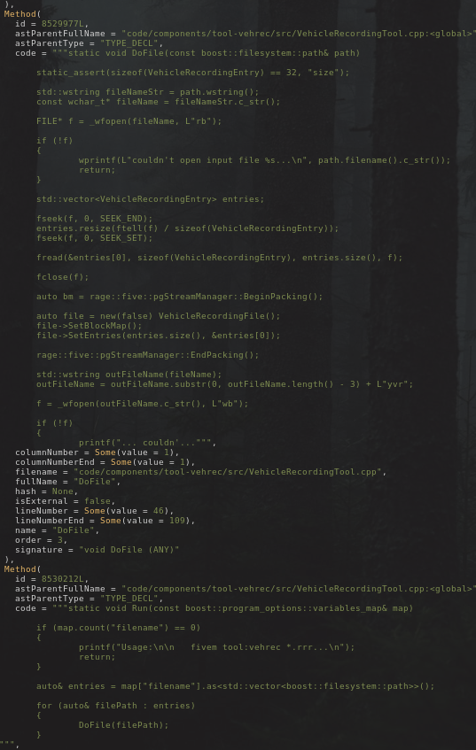
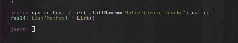

...
# Checkpoint 2 - Harsh Reality

As a quick review from our last checkpoint we accomplished the following:
1. Set up a  debug environment for the target (More on this later)
2. Found a buffer overflow bug in the codebase
3. Set up a plan to attack the target


## Debugging FiveM - A Painful Experience

Our expectation from the last checkpoint unfortunately did not come to a good end.
When we try running the debug build, for unknown reasons the server does not send
back the authentication ticket. Even when the server is deployed locally by us,
the behavior is the same. We believe that the release build of FiveM has
specific signature/key to link through Steam and FiveM signal server. Since we
do not have them in our debug build, the connection process fails. After a bit of research, it seems that FiveM process is unable to communicate with Steam or the Source SDK process it uses for connecting.


So we change to working directly with Release build instead, which we download
directly from [FiveM website](https://fivem.net/).
However, we unsuccessfully run FiveM through WinDbg or x64dbg,
because the process seems to aware of debugger and automatically exits shortly after starting up.
Nothing great happens when we switch to attaching process either.
For most processes, in few seconds after attaching, the debugger receives
0xC0000005 (EXCEPTION_ACCESS_VIOLATION) and cannot continue. We believe this
is the work of anti-debugger measures.
In the end, we could not figure out a workaround for accessing the memory,
and we decided to rely on observation from outside.

## The Buffer Overflow - Not all things go to plan

In our testing we set up a FiveM server with the CfxDefault configuration as well as our debug build client. For reasons explained earier, we had to continue with the basic client for testing purposes. To recap from last time, our attack scenario for the buffer overflow bug was a malicious server owner that sends users an *evil* script that would break out of the Lua or JS runtime environment with `NativeInvoke` and execute arbitrary code via the exploitation techniques we learned in the class.


### Setting Up The Server

We set up a local server on the same network as the client and hosted our script on there. The user would download the script and for ease of testing we registered executing the payload through an in game command. With this we were able to use printline debugging to print out values of returned statements. 

### NativeInvoke or InvokeNative
In Lua, our code is called `InvokeNative` which we can find the very well maintained documentation from [here](https://docs.fivem.net/docs/scripting-reference/runtimes/lua/functions/Citizen.InvokeNative). Yeah, there is pretty much no documentation on that here therefore we relied on older documentation, source code, and forum posts to figure out what this does. Essentially, it does the same thing as the `InvokeNative` but calls it through Lua and links to the C++ code in a separate file `code/components/citizen-scripting-lua/src/LuaScriptNatives.cpp` and `code/components/citizen-scripting-lua54/src/LuaScriptRuntime.cpp`. These two files have no mention of the original `InvokeNative` meaning we can either: focus entirely on the Lua implementation (which has been patched in the past) or we can focus on the buffer overflow we know is true in `NativeInvoke`. We chose to focus on what we have and figure it out through static analysis.


## Joern - The Limits of Static Analysis

Since we determined dynamic analysis is not optimal given the circumstances we can try our hand with some static analysis tools. Right now we have a `sink` which is our buffer overflow in `NativeInvoke` and we are trying to find a `source` that can somehow get our user input to that sink. With this we began trying to use Joern to statically analyze the source code which we can do with the `joern-parse` command. Forty minutes and 28GB of ram later we can load the call graph in and be met with our new errors.

### C++ Templates 

At a very high level, C++ templates allow for generics for C++ classes and functions at compile time. So very unlucky for us, `NativeInvoke` uses a template so we cannot use `joern` easily. Normally in Joern, we can run the following command to get the callers of a function:

```scala
cpg.method.filter(_.name=="printf").caller.l
```



Since Joern doesn't know about these generics and is matching with strings of functions and signatures to eachother this means we actually cannot get the callers of our function. 



Wonderful. I implemented a very hacky `scala` script to list out all the places we have `NativeInvoke.Invoke` and put it in JSON form to put into a file for storage

```scala
def getNativeInvokeCalls(max: Int=5): Unit = {
    var vec: Vector[(String, String,String)] = Vector()
    print("[")
    def addRecurse(cur: Traversal[Method],count: Int){
        cur.foreach({res=>
            if(res.size > 0 && count<max){
                if(res.fullName.contains("NativeInvoke.Invoke")){
                    print("{\"fullName\":\"")
                    print(res.fullName.replace("\"","'"))
                    print("\",\"filename\":\"")
                    print(res.filename)
                    print("\",\"lineNumber\":\"")
                    print(res.lineNumber)
                    print("\"},")
                }
                addRecurse(res.callee,count+1)
            }
        })
    }
    addRecurse(cpg.method,0)
    println("]")
}
```

So now we have all the places of `NativeInvoke.Invoke` in the code (at least for 5 layers, scaling up to 10 is very bad in my implementation). Now looking at these we find one or two points of interest but really nothing we can easily call as a server admin directly. We got some more places to look at manually for now but as you can see there is no straightforward method for automated static analysis. We might look at CodeQL if we have time but it might be better to continue Joern and code review to find areas of interest.


## Future Plans 

If we had a longer period of time remaining to attack the target, we might have tried to use fuzzing to find find crashes and bugs in the program. However, this would be very difficult for our current attack model. First off, we would have to do snapshot fuzzing to load our game state right before connecting to the server. We would also have a second snapshot phase for the server that would be able to load our new Lua runtime scripts that would be ran on the user client. This model would be very bad since it would be expensive because FiveM requires GPU and CPU power to run as well as slow even with added snapshot fuzzing because we would have to load into the server repeatedly. To fix this we might be able to load the LuaRuntTime separately from the client and run fuzzer inputs onto that with a grammar based fuzzer to generate inputs based off of `InvokeNative`. 

In general, the target is difficult to exploit even given the exploit we found for multiple reasons. 

1. Setting up a debug environment on a client with remote capabilities in difficult if not possible. This is likely due to some anti cheat measures which also limit debugging potential.
2. Static analysis is difficult because our codebase uses templates and other compile time code functionalities that obfuscate how certain methods are related to static analysis tools. 
3. The codebase is very large so while manual review can find us some bugs, it is difficult to see where we can funnel user input to exploit them. 
