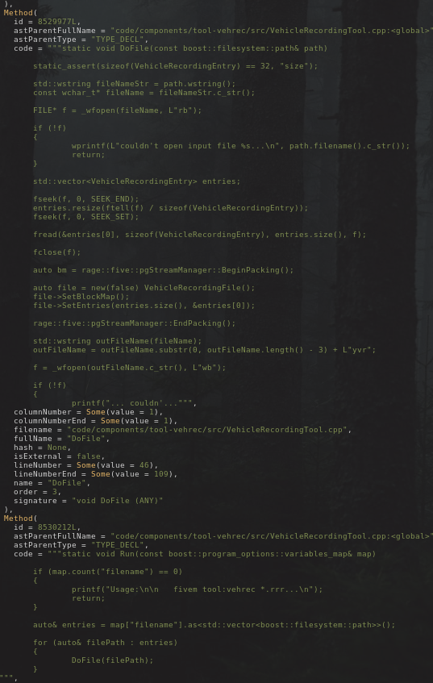
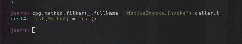
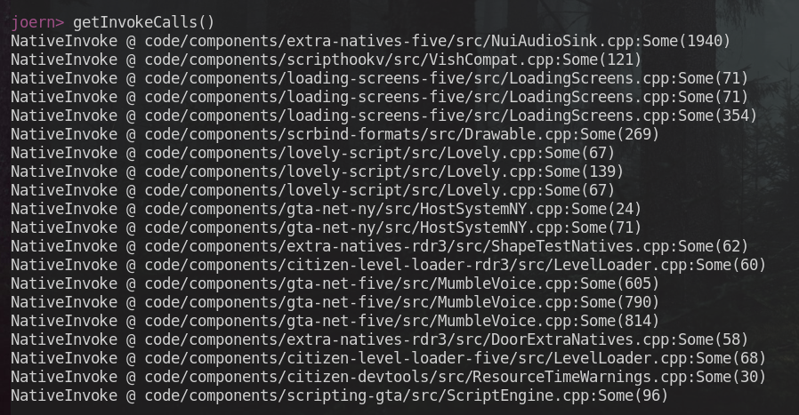
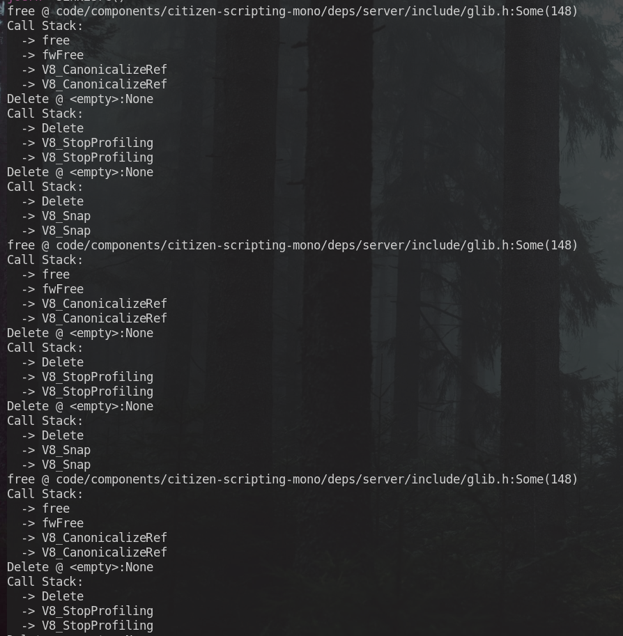

# *Attempting* to Hack The FiveM Client

The final project specification asked students to pick one target for bug hunting. When we were asked this we thought of many things but the main thing that crossed our minds was [FiveM](https://fivem.net/), a popular GTA V multiplayer modification client. One of the members in our group found bugs in several FiveM frameworks ranging from custom implementations to the second most popular framework, QBCore. But after all this, the target that fit best with the specification of this class was the FiveM client. Thus, we set out to see if we had what it takes to hack a open source project with 2900+ stars on github, hundreds of thousands of concurrent players, as well as hundreds of developers working to improve it. The repository containing all articles related to the client hacking can be found at our [Github repository](https://github.com/Jaquiez/FiveM-Client-Hacking).


## Introduction on Target

Before diving into the technical details of attacking the FiveM client, you are probably curious about what FiveM is. FiveM is a multiplayer game modification for the popular Rockstar Games product, Grand Theft Auto V (GTA 5). FiveM was developed by the team at CitizenFX who work to modify Rockstar Games' modern titles, all of which are open source and under the [same repository](https://github.com/citizenfx/fivem). Unlike most game modifications (known as mods in these communities), FiveM does not create one standalone experience. Instead, it gives developers an entire framework to interact with the GTA 5 process through the user client. The implementation uses the Citizen API that allows developers to use front-end runtimes/executables in Lua, Javascript, and even C# to make calls to the GTA 5 process. For example, a Javascript function `GetEntityHealth` will be passed in an ID of an in-game object and return its health, allowing developers to script out playing certain animations at certain health thresholds and more. Owners will host servers where they have these developers create scripts to interact with the GTA 5 process and FiveM client to provide users with a unique and seamless multiplayer experience. The above is a general overview of FiveM functionality, but there are a lot more moving parts to FiveM. The next section will cover what we focused on for the remainder of the project.


## The Attack Model

Since our codebase is massive, it makes the vulnerability analysis of the target very difficult. To minimize the scope of the analysis, we set up an attack model to restrict the context in which we attacked the application and treated exterior implementation details of the project as a black box. This was extremely helpful as it limited the scope in which we could research and attack the application to something more manageable for a team of beginner low-level bug hunters.

The attack model we established was a malicious server owner that sends users evil scripts that break out of the client runtime to run arbitrary code on the user system. This model relies on finding the C++ implementations of the Javascript V8 and Lua runtime and doing vulnerability analysis to discover bugs in them. During our assessment, we focused on the V8 Runtime because we had the most experience with Javascript, it is also the least researched of the runtimes, and it is relatively straightforward to set up.

Before we could begin testing the Javascript runtime, we needed to first create out environment. For this we used IWS to create one Windows virtual machine to create a FiveM server running the default Cfx configuration and connected to it via any of the gaming capable desktops in the Cybersecurity room. With this setup, we created one manifest file to register commands in game and enabled them through our server. When we ran the commands our code would run in the client side engine. This allowed us to make edits and deploy them to the client without restarting the server or client. The demo video for this can be found [here](https://docs.google.com/file/d/1bp3jlcvRJp20bJoeucy0-ELNP4q1OERJ/preview). With this set up, we can move into setting up a debug client.

## Debugging the client

### Debug build

Initially, we expect this to be a simple task: starting or attaching x64dbg and
we can start debugging. Since the source code is available [online](https://github.com/citizenfx/fivem.git), we successfully compiled a debug build from the repo.
However, when running the debug build, we were not able to connect to the server.
If the text box is true, the server we are hosting is not accepting and sending
back authentication ticket to our debug client.
We believe that the release build of FiveM has specific signature/key to link
through Steam and FiveM signal server. Since we do not have them in our debug
build, the connection process fails. After a bit of research, it seems that FiveM
process is unable to communicate with Steam or the Source SDK process it uses for
connecting.


### Official release build

So we changed to working with the official build version. Unfortunately, as soon
as we use WinDbg or x64dbg, the process terminates shortly after, before the RIP
could reach breakpoint. We suspect that the process can detect debugger on start,
so we switch to attaching to the running (sub)processes.


At normal start, `FiveM.exe` produces the following processes (XXXX is 4-letter build number):

```
FiveM_bXXXX_GTAProcess.exe
FiveM_bXXXX_DumpServer.exe
FiveM_ROSService
FiveM_ROSLauncher
FiveM_SteamChild.exe
FiveM_ChromeBrowser.exe
```

Given that our watch target is V8 engine and Lua runtime,
we look for process that imports `citizen-scripting-v8client.dll`,  `citizen-scripting-v8node.dll`, `citizen-scripting-lua54.dll`,
`citizen-scripting-lua.dll`. Using Sysinternals Process Explorer, we found that
only `FiveM_bXXXX_GTAProcess.exe` matches.


In few seconds after attaching to `FiveM_bXXXX_GTAProcess.exe`, exception such
as `EXCEPTION_ACCESS_VIOLATION (0xC0000005)`,
`EXCEPTION_ILLEGAL_INSTRUCTION (0xc000001d)` occurred and we could not continue.
Looking at the disassembly, the address and instructions looks irregular,
suggesting that certain kind of anti-debugger measures were implemented.

### Anti-anti-debug

Believing this is anti-debug issues, we found out ScyllaHide, an advanced
user-mode anti-anti-debugger. Sadly, only the crash time is longer, which means
there are multiple layers of anti-debugger. We also attempted enabling all measures
provided by the library, but there are no significant changes.


We decided to look at the call stack during crashing. When clicking at several code
addresses, they points to either middle of an instruction or invalid location.
Even when it points to the start of an instruction, that instruction is not
`jump`, `call`, and also does not affect RIP at all.
Our initial thought is that anti-debugging is still working and has shifted the RIP.


At one thread, we found the existences of calls to `DbgPrint` and 
`DbgBreakPoint` inside `FiveM_bXXXX_GTAProcess.exe`, and we traced the import
and found that they are from `ntdll.dll`. Technically, both of the calls are Windows APIs that execute `int 2D`, an interrupt to switch control to kernel debugger, similar
to what the names suggest. But `int 2D` can also be used to anti-debug as it
causes one byte shift after generating exception in several debuggers like OllyDbg.
Suspecting this to be the issue, we set breakpoint at `ntdll.dll` and replaced
`int 2D` with `nop` before `ntdll.dll` is loaded, but then the game windows no
longer show up. With n successful results, we insisted on finding measures that
is similar to `int 2D` in the source code instead.


### Anticlimactic

When we were searching anti-debug reference in the source code of FiveM,
we came across this part at
[code/client/citicore/SEHTableHandler.Win32.cpp, line 312-316](https://github.com/citizenfx/fivem/blob/2416297b835adc97d759542d94925dfad90903c1/code/client/citicore/SEHTableHandler.Win32.cpp#L312-L316):

```c++
static BOOLEAN WINAPI RtlDispatchExceptionStub(EXCEPTION_RECORD* record, CONTEXT* context)
{
	// anti-anti-anti-anti-debug
	if (CoreIsDebuggerPresent() && (record->ExceptionCode == 0xc0000008 /* || record->ExceptionCode == 0x80000003*/))
	{
		return TRUE;
	}
```

`0xc0000008` exception code is STATUS_INVALID_HANDLE, meaning invalid handle.
Based on the file name, an educated guess is that the program even has custom code
to handle Win32 SEH (Structured Exception Handling), which is a mechanism that takes control and unwinds program in case an exception occurs
in Windows. At this point, we realize the fact that GTA V itself is 
hard to debug, so the FiveM needs to implement several anti-debug in order to
attach to FiveM.

Tracing `CoreIsDebuggerPresent` users, we found out that it is mostly used to
workaround when debugging FiveM. For example, at [code/client/shared/Utils.cpp, line 186-197](https://github.com/citizenfx/fivem/blob/2416297b835adc97d759542d94925dfad90903c1/code/client/shared/Utils.cpp#L186C13-L197):

```c++
#if defined(_M_AMD64)
	if (CoreIsDebuggerPresent())
	{
		// thanks to anti-debug workarounds (IsBeingDebugged == FALSE), we'll have to raise the exception to the debugger ourselves.
		// sadly, RaiseException (and, by extension, RtlRaiseException) won't raise a first-chance exception, so we'll have to do such by hand...
		// again, it may appear things 'work' if using a non-first-chance exception (i.e. the debugger will catch it), but VS doesn't like that and lets some
		// cases of the exception fall through.

		RaiseDebugException(buffer.c_str(), buffer.length());
	}
	else
#endif
	{
		OutputDebugStringA(buffer.c_str());
	}
```

Here, they re-raise the exception just so that debugger would not steal the
original exception. As it turns out, the error we received at the beginning
might have been explicit exceptions raised by FiveM itself.

In conclusion, it is likely that our x64dbg and ScyllaHide have intervened
the FiveM attaching process and caused issues.
In fact, the `DbgBreakPoint` above is actually from ScyllaHide's hook library.
Since we have been fighting _another debugger that has anti-anti-debug_ and we
did not have the same debugger as the developer,
we eventually decided to rely on outside observation instead.

## NativeInvoke & InvokeNative


### NativeInvoke
Before we established an attack model, we read through the source code to get an understanding of the project. In our initial readthrough of the source code, we noticed one class `NativeInvoke` had some code that *looked* a lot like some bugs we've seen in class. But before that, what is `NativeInvoke`. `NativeInvoke` is a class that includes a function `Invoke` that takes in an address to a GTA 5 method as well as the arguments to that method. Then the RAGE scripting engine will take these and execute the method in game. Afterwards it will return the response to the `NativeInvoke` which will in turn return it to the original caller. Let's see how it's implemented:

```C++
class NativeInvoke
{
public:
	template<uint32_t Hash, typename R, typename... Args>
	static inline R Invoke(Args... args)
	{
		NativeContext cxt;
		(cxt.Push(args), ...);

		static auto fn = rage::scrEngine::GetNativeHandler(Hash);
		if (fn != 0)
		{
			fn(&cxt);
		}

		if constexpr (!std::is_void_v<R>)
		{
			return cxt.GetResult<R>();
		}
	}
};

```

Okay, this is fine so far. How does the `NativeContext` look?

```C++
class NativeContext :
	public rage::scrNativeCallContext
{
private:
	// Configuration
	enum
	{
		MaxNativeParams = 16,
		ArgSize = 4,
	};

	// Anything temporary that we need
	uint8_t m_TempStack[MaxNativeParams * ArgSize];

public:
	inline NativeContext()
	{
		m_pArgs = &m_TempStack;
		m_pReturn = &m_TempStack;		// It's okay to point both args and return at 
										// the same pointer. The game should handle this.
		m_nArgCount = 0;
		m_nDataCount = 0;
	}

	template <typename T>
	inline void Push(T value)
	{
		if (sizeof(T) > ArgSize)
		{
			// We only accept sized 4 or less arguments... that means no double/f64 or large structs are allowed.
			throw "Argument has an invalid size";
		}
		else if (sizeof(T) < ArgSize)
		{
			// Ensure we don't have any stray data
			*reinterpret_cast<uintptr_t*>(m_TempStack + ArgSize * m_nArgCount) = 0;
		}

		*reinterpret_cast<T*>(m_TempStack + ArgSize * m_nArgCount) = value;
		m_nArgCount++;
	}
/*...*/
}
```

The `Push` method correctly checks argument sizes but our `TempStack` is continually pushed into without regards for its size. Meaning, if we are able to push enough arguments onto the stack such that it is greater than the size of the buffer then a buffer exploit is possible. Unfortunately, as much as this *looks* like a buffer overflow it is unfortunately not, well not really. In the `Invoke` function definition we see `static inline R Invoke(Args... args)`, especially the `Args.. args` which is a function [parameter pack](https://en.cppreference.com/w/cpp/language/parameter_pack) that accepts zero or more function. In other words, this method will have a special definition for each number of possible arguments it can have *at compile time*. To exploit this, we must find any calls to `InvokeNative` with more than 16 arguments then we can actually cause an overflow. We'll go more into how we checked for this in the automated code analysis section.

## Invoke Native
So, since this `NativeInvoke` had a buffer overflow and was a static (compile time), we decided to focus on the frontend scripting API. In this, we found that they had a similar function `InvokeNative` that did the same thing as `NativeInvoke` but was dynamic and implemented differently. However, our hopes were quickly crushed when we found that this was patched and [previously exploited](https://blog.back.engineering/26/09/2022/). In this we decided to focus on V8 since Lua was mostly exploited by the attacker in the blog. Similarly, we decided to read through the source of both `InvokeNative` as well as all other `Citizen` functions. 

How are these frontend functions implemented though? Essentially, there is a struct that holds keys that the names of these citizen functions and the values are the pointer to each respective function. Additionally, these functions are patched directly into the Runtime meaning they are callable via `Citizen.[FunctionName]`. With this, we looked through the code and scanned for memory bugs and our eyes found basically **nothing**. We also attempted to call these `Citizen` functions from the frontend with weird or edge case parameters but did not get any weird behavior or erros from the output logs. With these failiures, we decided to move onto automated vulnerability analysis to push us in the right direction. At this point due to time and resource constraints we attempted to do automated static analysis.

## Automated Static Analysis

### Introduction

Since we determined dynamic analysis is not optimal given the circumstances, we can try our hand with some static analysis tools. We created two main strategies for bug hunting with our tool [Joern](https://joern.io/). Joern brings our code into nodes with additional associated information like callers, callees, args, etc. These nodes are interactable with the use of scala CLI/scripts to find bugs in the codebase. In our case, we had two strategies when looking for bugs in the program. The first involved scanning with Joern to find all places where `NativeInvoke` is used in the code and checking these locations to find where we can either find a place with 17+ arguments or dangerously passing user-controlled data. The second strategy was to create a *sink and source* model where our sources were all of the Citizen V8 functions while our sinks were any dangerous or potentially dangerous C++ functions that could introduce bugs.


### Finding NativeInvoke

#### C++ Templates
At a very high level, C++ templates allow for generics for C++ classes and functions at compile time. So very unlucky for us, `NativeInvoke` uses a template so we cannot use `joern` easily. Normally in Joern, we can run the following command to get the callers of a function:

```scala
cpg.method.filter(_.name=="printf").caller.l
```



Since Joern doesn't know about these generics and is matching with strings of functions and signatures to eachother this means we actually cannot get the callers of our function. 




A workaround for this was to write a custom scala script to go iterate through all the base methods in the program and recursively iteratte through the methods of their callers and return any point where we find a `NativeInvoke` call in the code. The code looked like the following:

```scala
def getInvokeCalls(max: Int=5): Unit = {
    def addRecurse(cur: Traversal[Method],count: Int){
        cur.foreach({res=>
            if(res.size > 0 && count<max){
                if(res.code.contains("NativeInvoke")){
                    print("NativeInvoke @ ")
                    print(res.filename)
                    print(":" )
                    print(res.lineNumber)
                    println()
                }
                addRecurse(res.callee,count+1)
            }
        })
    }
    addRecurse(cpg.method,0)
}
```

And running it in the code we get the following output:



Now when we individually look at all of these calls we do not find anything out of the ordinary. Therefore, we moved to our second strategy.

### Mapping Sinks to Sources

The next strategy involves us declaring two lists, one for our sources (Citizen functions) and the other for our sinks (dangerous C++) functions. This part is simple enough, we write a script to iterate through all our source functions and recursively search through their callees for any sinks. If we find one we print the call stack to get to it as well as where we can find it. The script is below:

```scala
def sink2src(max: Int=5) {
    val sinks = List("printf", "memcpy", "scanf","free","Delete","strcpy","malloc","calloc","execve","sprintf","vsprintf","gets","fgets","read")
    val sources = List("V8_Trace","V8_SetTickFunction","V8_SetEventFunction","V8_SetCallRefFunction","V8_SetDeleteRefFunction","V8_SetDuplicateRefFunction","V8_CanonicalizeRef","V8_MakeFunctionReference","V8_GetTickCount","V8_InvokeNative<StringHashGetter>","V8_InvokeNative<IntHashGetter>","V8_InvokeNativeRaw","V8_Snap","V8_StartProfiling","V8_StopProfiling","V8_SetUnhandledPromiseRejectionRoutine","V8_SubmitBoundaryStart","V8_SubmitBoundaryEnd","V8_SetStackTraceRoutine","V8_GetPointerField<V8MetaFields::PointerValueInt>","V8_GetPointerField<V8MetaFields::PointerValueFloat>","V8_GetMetaField<V8MetaFields::PointerValueInt>","V8_GetMetaField<V8MetaFields::PointerValueFloat>","V8_GetMetaField<V8MetaFields::PointerValueVector>","V8_GetMetaField<V8MetaFields::ReturnResultAnyway>","V8_GetMetaField<V8MetaFields::ResultAsInteger>","V8_GetMetaField<V8MetaFields::ResultAsLong>","V8_GetMetaField<V8MetaFields::ResultAsFloat>","V8_GetMetaField<V8MetaFields::ResultAsString>","V8_GetMetaField<V8MetaFields::ResultAsVector>","V8_GetMetaField<V8MetaFields::ResultAsObject>","V8_GetResourcePath")
    
    def recurseSearch(cur: Traversal[Method], count: Int): Boolean = {
    cur.filter(!_.name.contains("<operator>")).foreach { res =>
        if (res.size > 0 && count < max) {
        if (sinks.contains(res.name)) {
            println(s"${res.method.name} @ ${res.filename}:${res.lineNumber}")
            println("Call Stack:")
            println(s"  -> ${res.name}")
            return true
        } else {
            val found = recurseSearch(res.callee, count + 1)
            if (found) {
            println(s"  -> ${res.name}")
            return true
            }
        }
        }
    }
    false
    }


    cpg.method.filter{method=>sources.contains(method.name)}
        .foreach{res=>
            var found = recurseSearch(res,0)
            if(found){
                println(s"  -> ${res.name}")
            }
    }
}
```

The output of this script finds a couple `free` and many `Delete` but again, we did not find anything that stood out:



With that, we exhausted the time and ideas we had for static analysis and presented our findings to the class. However, there are still ideas we didn't try that will definitely be interesting if we attempt to attack this target in the future.

## Future Plans

For the future, we hope to employ more dynamic techniques like taint analysis and fuzzing. Specially, we believe fuzzing the target would bring the most success. To fuzz this target we would have two options. The first is to fuzz the V8Runtime directly by writing a harness to interact with the DLL and execute our Javascript. The fuzzer would be grammar based to generate valid Javascript and call the Citizen functions with the correct arguments. In this example, we would take our crashes and usee the same input in our previous manual set up to debug what caused the crashes and if it led to anything exploitable. Alternatively we could do the same thing but create a custom snapshot based fuzzer that uses the FiveM server API to update the Javascript for each mutation and load the client at the point it finished loading into the game and executes the script. We would verify crashes the same way as our other fuzzer.


### Final Remarks

With this have finished cataloging our assessment of the target and concluded a few things. *Attacking large targets is hard*. If we were to redo this whole project we would pick a smaller target we could really dive into and get to understand entirely. *Time is key*. Good vulnerability research takes time and if we had more time and experience we could have evaluated this target better. *Pick something easy to debug*. Debugging is very important, and when you can't properly debug it sucks. Picking a target that had less debug protections would have made it a lot easier. All in all, this was a fun project to get to know how real world vulnerability research is done and what we can expect from real life targets.